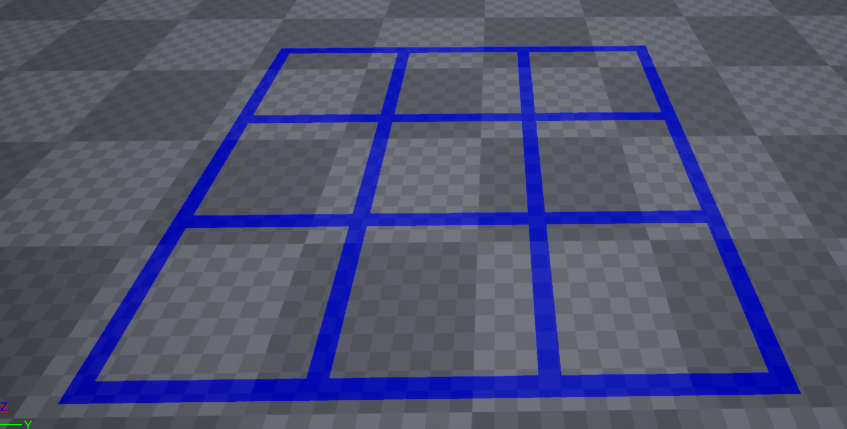
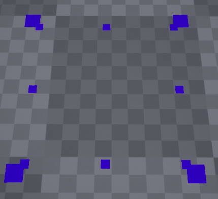
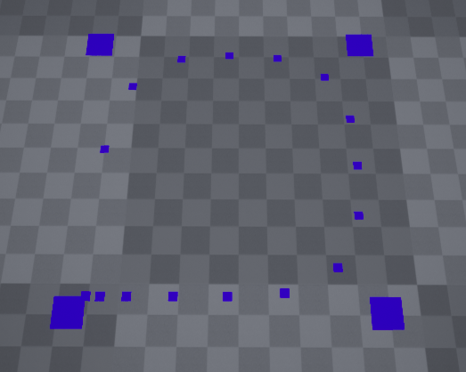

# Procedural generiertes Grid Mesh

## Überblick
Die Zielstellung des Projekts war es, in der Unreal Engine 4 ein Mesh dynamisch zu generieren, das ein N x M Grid darstellt. Dabei sollten über mehrere Parameter frei wählbar sein. Zusätzlich sollten die Ecken der Innenflächen durch Implementation von NURBS geglättet werden.

Das Projekt basiert auf dem "Topdown" Templet der Unreal Engine 4. In diesem Template ist eine Figur implementiert, die mit der Maus bewegt werden kann. Die Kamera, die Beleuchtung, die Steuerung und Physik sind hier schon enthalten.
Ich habe mir zunächst Inspiration von einem youtube [Tutorial](https://www.youtube.com/watch?v=Q4AOmT9aOEM) geholt, um mich in die Engine, sowie in das Thema einzuarbeiten. In diesem Tutorial erfolgt die Implementation größtenteils durch UE4 Templates. Ich habe Aspekte davon in Form von C++ code nachgebaut. Der relevante code befindet sich unter '/Source/Yeet_FromTopdown/Grid_Actor.cpp' und der dazugehören header-Datei.

Leider ist mir beim Hochladen ein faux pas mit git passiert und ich habe einige commits Fortschritt verloren. Der code, mit dem die Screenshots generiert sind, ist nicht mehr ganz zu reproduzieren, aber spiegelt wieder, was ich in der Vorlesung präsentiert hatte (ich hatte noch etwas zu den nurbs ergänzt).

## Das Grid

Fertiggestellte Features:
- Höhe [x]
- Breite [x]
- Opacity [x]
- Color [x]
- Linienbreite [x]
- Controll Points [x]
- NURBS [-]
- Triangles mit diskretisierten NURBS

Unter Angabe der Parameter werden erst die Vertices und Triangles für horizontalen und vertikale Linien, dann für die Eckpunkte generiert. Durch geschickt gewählte Reihenfolg beim Einfügen in das Array wird sichergestellt, dass die Normalen in die selbe Richtung zeigen.

## Controll Vertices

Beim erstellen der Eckpunkte der Linien befülle ich ein weiteres Array mit Indices für die Eckpunkte der Innenflächen. Dann werden die Punkte dazwischen berechnet und einem ControllPoint Array hinzugefügt. Es konnten beliebig viele Unterteilungen (t) gewählt werden.

## NURBS

Ich habe eine rekursive Berechnung der Basisfunktion für ein beliebigen Grad N implementiert. Dabei wurden zu den ControllPoint Gewichte generiert. Der Knotenvektor U wuchs auch dynamisch, jedoch habe ich nicht die richtige Kombination aus Gewichten und Knotvektor finden können um einen Kreis zu bilden, wie auf dem Bild zu sehen ist.

Es war geplant, ein Menü in das "Spiel" einzubauen, wo die parameter dynamisch eingestellt werden könnten. Dazu bin ich nicht mehr gekommen. Es sollte möglich sein, die Parameter zu übergeben, so dass die Gewichte und die Menge der Unterteilungen angepasst wird. Das ist ebenfalls auf der Strecke geblieben.

Die Kontrollpunkte werden je Feld gespeichert. Aus Effizienzbetrachtung ist das allerdings nicht nötig, denn wenn man die NURBS vertices für das erste Feld berechnet, kann man sie auch durch Translation einfach auf die restlichen Felder kopieren ohne sie neu berechnen zu müssen.

## Rendering in UE4

Das Rendering in UE4 benutzt die Pipeline von DirectX11/DirectX12 und unterstützt viele features die dort enthalten sind.
Die Folgenden Informationen zum Rendering in der Unreal Engine 4 sind der offizellen Dokumentation entnommen.
- [rendering](https://docs.unrealengine.com/en-US/RenderingAndGraphics/Overview/index.html)
- [mesh drawing](https://docs.unrealengine.com/en-US/ProgrammingAndScripting/Rendering/MeshDrawingPipeline/index.html)
- [material](https://docs.unrealengine.com/en-US/RenderingAndGraphics/Materials/index.html)

### Materials

Einem Mesh kann hier ein sogenanntes "Material" hinzugefügt werden, welches über verschiede Eigenschaften verfügt, die beim rendern berücksichtigt werden. Materials haben Inputs, die Faktoren wiederspiegeln, die sich auf das Aussehen auswirken. So hat jedes Material z.B. ein Shading Model, das Eigenschaften kombiniert, welche die Farbe bestimmen.
Diese Materials werden nicht über c++ code, sondern durch vorimplementierte Templates realisiert, die HLSL code enthalten. Dabei gibt es unterschiedliche Aten von Materials für unterschiedliche Anwendungszwecke.
So kann z.B. ein Bump Mapping realisiert werden, indem man ein einem Material eine normal-map speichert und einige Parameter angibt.

In meinem Fall lasse ich den Constructor eine dynamische Material-Instanz generieren, die über die Parameter "Color" und "Opacity" verfügt. Diese wird dann dem Mesh hinzugefügt.

### Rendering Pipeline
In der Grafischen Oberfläche von UE4 kann für jede Scene ein Rendering Dependency Graph angegeben werden, um die Abhängigkeit zwischen verschiedenen Shadern und rendering Schritten festzulegen. Unter der Haube existier ein Shader Cache um die Verarbeitung zu beschläunigen.

Als erstes werden Meshes aus einer Szene gesammelt und zu einem Mesh Batch zusammengefügt. Dann wird vom "MeshPassProcessor" ermittelt, welche Views es gibt und welche Draw-commands dazugehören. Diese haben dann Parameter, sogenannte "Shader bindings", die darüber entscheiden welche Shader, Texturen und Materialien tatsächlich eingesetzt werden.
